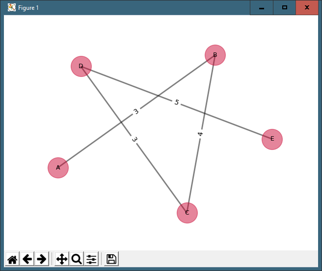
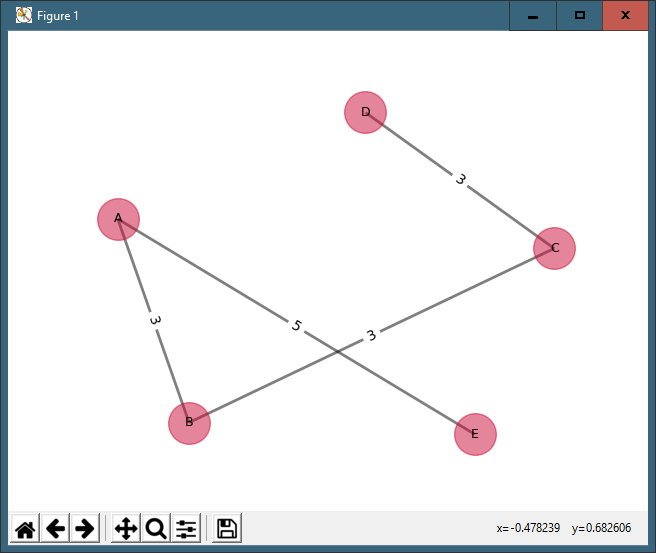

# MST_Prim-s_and_Kruskal-s

### Brief Description
Simple visualization for Minimum Spanning Tree using Prim's and Kruskal's Algorithm
### Instalation Guide
1. Go to your repository file.
2. Type python <kruskal.py / prim.py> < your dataset filename in txt format> to run the codes.

    e.g : `Python Kruskal.py dataset1.txt`
    
### Article Paper for Perfomance Analysist 

### Make sure you already installed `Matplotlib` and `Networkx` package

### Documentation

